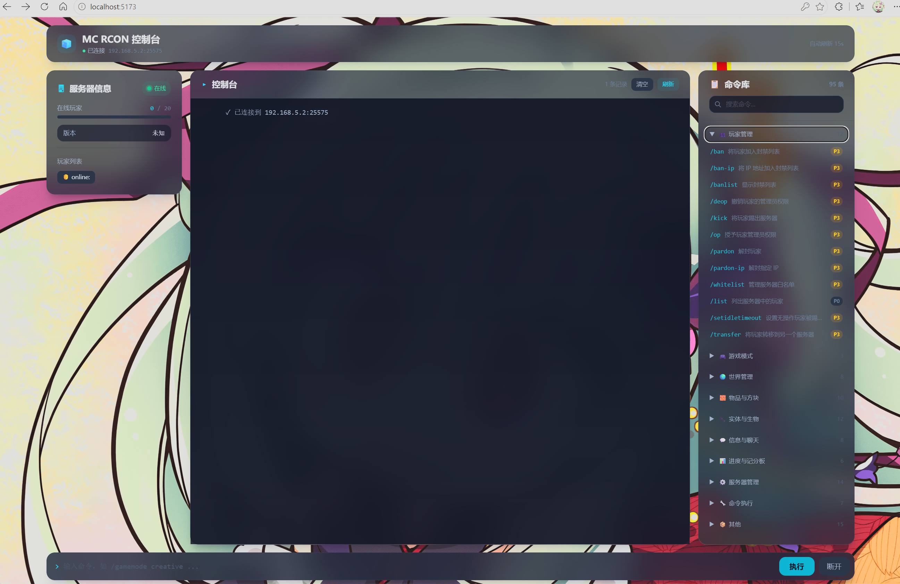
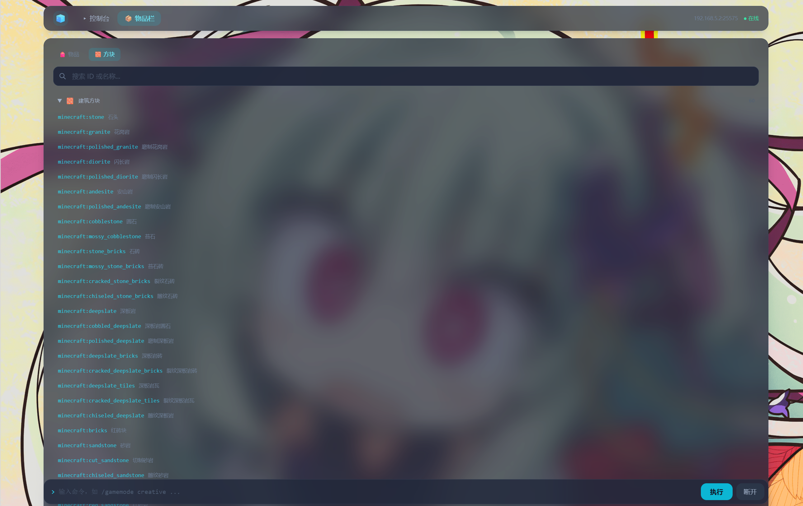

# Minecraft RCON Control Panel
[在线体验，注意服务器要有公网 IP！](https://cherrylanterns.cn/mcrcon/) <br>
基于 Web 的 Minecraft 服务器远程管理控制台，通过 RCON 协议连接服务器，提供图形化的命令管理界面。

## 功能

- **服务器信息面板** — 实时显示在线玩家、版本、TPS/MSPT、Mod 列表
- **控制台终端** — 命令输入输出日志，彩色分类显示
- **命令库** — 90+ Java 版命令，按类别分组，可搜索，点击查看详情和用法
- **智能补全** — 类似游戏内 Tab 补全，支持参数提示（如 `/gamemode` → `creative|survival|adventure|spectator`）

## 截图

 




## 技术栈

| 层 | 技术 |
|---|---|
| 前端 | Vue 3, TypeScript, Vite, Tailwind CSS |
| 后端 | Node.js, Express |
| RCON | [rcon-client](https://www.npmjs.com/package/rcon-client) v4 |

## 快速开始

```bash
# 安装依赖
npm install

# 开发模式（同时启动前后端）
npm run dev

# 生产构建
npm run build
npm start
```

开发模式下：
- 后端运行在 `http://localhost:8080`
- 前端 Vite 开发服务器运行在 `http://localhost:5173`，API 请求自动代理到后端

## 使用说明

1. 确保 Minecraft 服务器已开启 RCON（`server.properties` 中设置 `enable-rcon=true` 和 `rcon.password`）
2. 打开控制台页面，输入服务器地址、RCON 端口（默认 25575）和密码
3. 连接成功后进入仪表盘，可在命令库中浏览命令或直接输入执行

## 项目结构

```
├── server.js              # Express 后端 & RCON 连接管理
├── src/
│   ├── main.ts            # Vue 入口
│   ├── App.vue            # 主布局 & 状态管理
│   ├── commandData.ts     # 命令数据库 & 自动补全逻辑
│   ├── styles.css         # 全局样式 & Tailwind
│   └── components/
│       ├── ServerInfoPanel.vue   # 服务器信息面板
│       ├── ConsolePanel.vue      # 控制台终端
│       ├── CommandLibrary.vue    # 命令库面板
│       ├── CommandDetailModal.vue # 命令详情弹窗
│       └── CommandInput.vue      # 命令输入 & 自动补全
├── public/                # 静态资源
├── index.html             # HTML 入口
├── vite.config.ts         # Vite 配置
└── tailwind.config.js     # Tailwind 配置
```

## License

MIT
